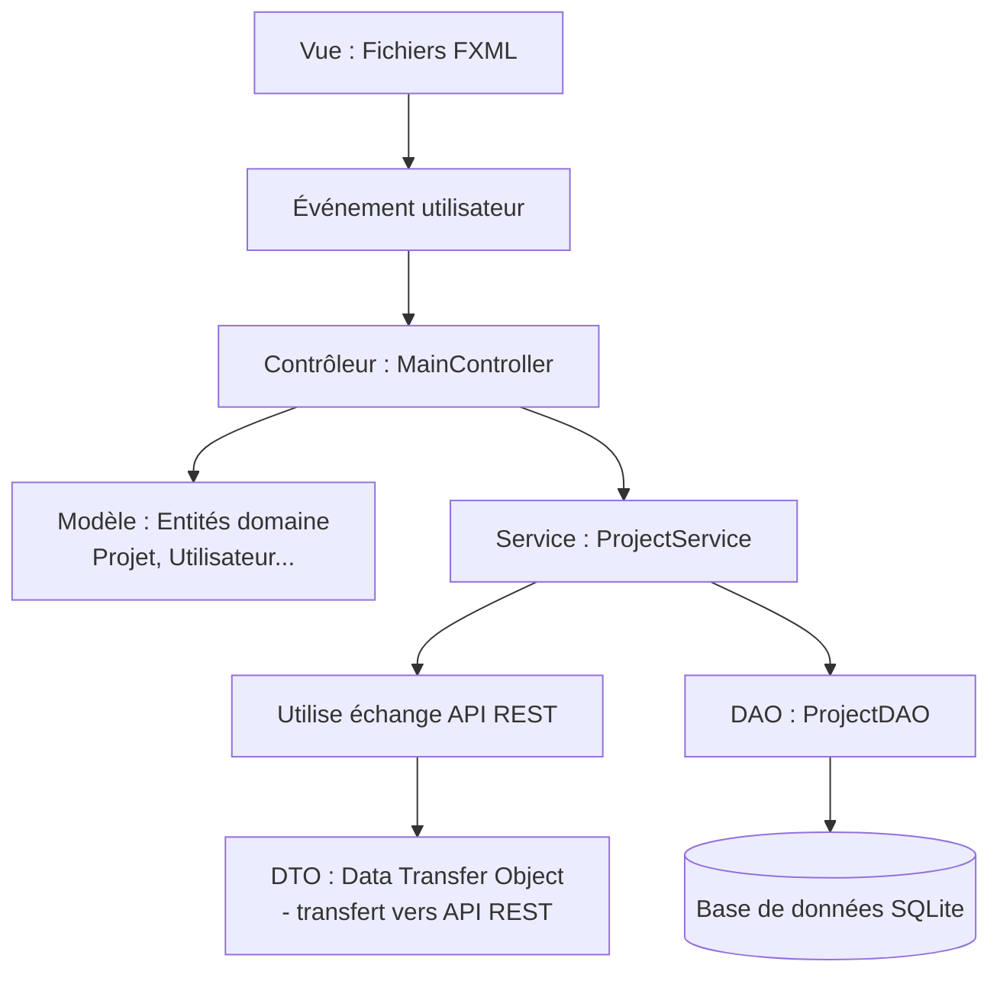
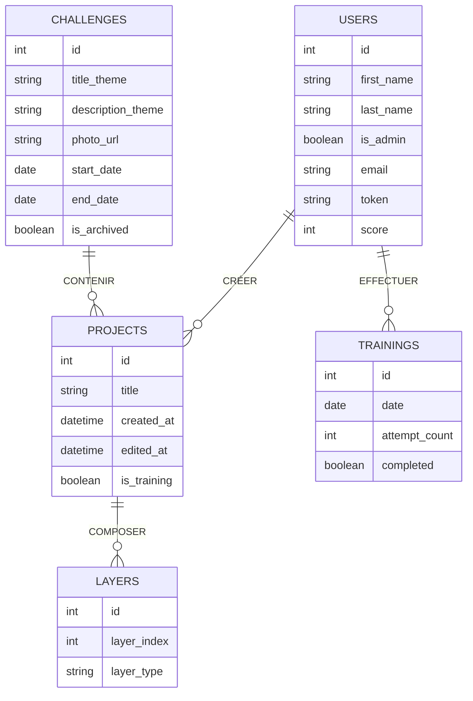
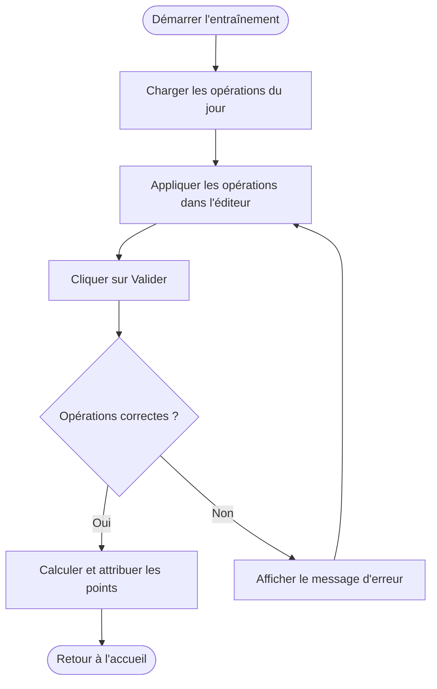
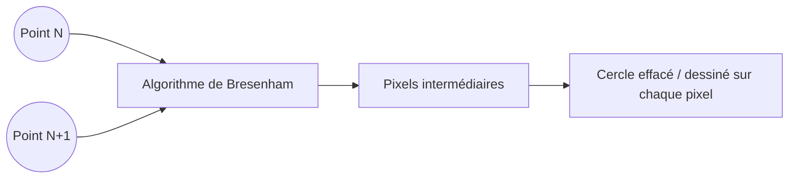

# Le projet

Projet réalisé dans le cadre de l'épreuve E6 du BTS SIO 2026 - Option SLAM.

Ce projet consiste en la conception d'une application de bureau pour l'entreprise fictive FrameLab, spécialisée dans la vente de matériel photographique haut de gamme et l'organisation d'événements destinés aux passionnés de photographie.

Dans le cadre de sa stratégie de fidélisation, elle organise des challenges photo hebdomadaires reposant sur un thème et une image imposée.

Ce projet est la composante desktop de l'écosystème FrameLab. Il vient compléter [FrameLab Web](https://matmathmat.github.io/framelab-back/), la plateforme communautaire développée en parallèle, qui gère la visualisation des participations, les votes, les commentaires et le classement des contributeurs.

L'application desktop consomme directement le backend de FrameLab Web via son API REST. Ce backend constitue donc la source de vérité partagée entre les deux projets : les utilisateurs créent leur compte et consultent les résultats sur le site web, mais c'est exclusivement depuis l'application desktop qu'ils téléchargent la photo du challenge, la retouchent et soumettent leur participation.

Le principe de fonctionnement global est le suivant :

1. un thème est publié chaque semaine sur la plateforme web ;
2. une image de base est mise à disposition des participants ;
3. l'utilisateur ouvre l'application desktop et télécharge automatiquement l'image du challenge en cours ;
4. il réalise sa retouche avec les outils mis à disposition ;
5. il sauvegarde son projet localement ;
6. il soumet sa création directement vers la plateforme web via l'API REST.

L'ensemble des participations est alors visible publiquement sur le site web, afin de permettre aux membres de la communauté de consulter les créations, voter selon plusieurs critères, commenter les participations et suivre les meilleurs contributeurs.

La documentation complète de l'API REST utilisée est disponible ici : [https://matmathmat.github.io/framelab-back/](https://matmathmat.github.io/framelab-front/api/)

---

## Objectifs techniques

Le projet devait répondre aux exigences techniques définies dans le cahier des charges de l'épreuve E6 :

- mise en place d'une architecture MVC+S (Model-View-Controller-Service) ;
- développement d'une interface graphique JavaFX avec fichiers FXML et CSS ;
- persistance locale des projets de retouche via SQLite ;
- communication avec l'API REST de FrameLab Web (authentification, récupération du challenge, soumission) ;
- implémentation d'outils de retouche d'image (filtres, transformations, dessin, calques) ;
- gestion sécurisée du token JWT ;
- développement selon une approche TDD avec JUnit 5.

Les technologies imposées par le cahier des charges étaient les suivantes :

| Composant              | Technologie                |
| ---------------------- | -------------------------- |
| Langage                | Java 21                    |
| Framework UI           | JavaFX 21.0.2              |
| Gestionnaire           | Maven                      |
| Tests                  | JUnit 5.9.2                |
| Base de données locale | SQLite (JDBC) 3.45.0.0     |
| Communication API      | HttpClient (Java 11+)      |

---

## JavaFX et architecture de l'application

L'application est construite autour de JavaFX, qui assure la séparation entre interface, logique métier et gestion des données. Elle suit un modèle MVC+S (Model-View-Controller-Service).



- Vues (FXML) : définissent la structure visuelle et les styles (CSS). Elles gèrent l'affichage et les interactions utilisateur.
- Controllers : assurent le lien entre les vues et la logique métier. Ils déclenchent les traitements via les services et mettent à jour les vues.
- Models : représentent les entités du domaine (Projet, Utilisateur, Calque...).
- DTO : objets simples utilisés pour transporter les données lors des échanges avec l'API REST.
- DAO : gèrent l'accès à la base SQLite locale (requêtes SELECT, INSERT, UPDATE).
- Services : couche intermédiaire centralisant la logique métier complexe (sessions, gestion des projets, appels API).
- Modules : implémentent le pattern Strategy pour les opérations d'image (filtres, rotations, dessin).

### Organisation des vues

Les fichiers FXML sont organisés dans `resources/view`. Les styles associés se trouvent dans un dossier `css` structuré de la même façon.

Les vues principales sont :

- `login` — connexion ;
- `home` — tableau de bord ;
- `challenge` — affichage du challenge en cours ;
- `editor` — éditeur de retouche.

Toutes sont des sous-vues de `main`, la fenêtre principale, qui est responsable d'afficher la vue appropriée selon le contexte.

---

## Base de données locale

Comme le backend de FrameLab Web, l'application desktop utilise SQLite comme base de données. Ce choix assure une cohérence technique entre les deux projets et simplifie le déploiement : aucun serveur externe n'est nécessaire, la base est un simple fichier stocké au même niveau que l'application.

La base locale contient cinq tables :



Un utilisateur invité est inséré par défaut à l'initialisation pour permettre un accès sans connexion.

---

## Rules (Règles métier)

| ID   | Règle                                                                                              |
| ---- | -------------------------------------------------------------------------------------------------- |
| R01  | Un utilisateur non connecté peut accéder à l'éditeur en mode invité, sans pouvoir soumettre.      |
| R02  | Le token JWT est stocké localement et rechargé automatiquement au démarrage.                       |
| R03  | Si le token est expiré ou invalide, l'utilisateur est redirigé vers l'écran de connexion.         |
| R04  | Le challenge en cours est récupéré via `GET /api/challenges/current`.                             |
| R05  | Si aucun challenge n'est actif, un message informatif est affiché.                                |
| R06  | L'image du challenge est téléchargée et stockée localement. Elle n'est pas retéléchargée si elle existe déjà. |
| R07  | Un projet est associé à un challenge et à un utilisateur.                                         |
| R08  | Un projet contient au minimum un calque.                                                          |
| R09  | Les calques sont ordonnés et leur ordre est persisté en base locale.                              |
| R10  | Les opérations d'image (filtres, dessin...) ne s'appliquent que sur le calque actif.             |
| R11  | Seuls les calques de type transparent (dessin) acceptent le pinceau, la gomme et les emojis.     |
| R12  | La gomme efface les tracés crayon et les emojis posés sur un calque transparent.                 |
| R13  | La fusion ne concerne que les calques visibles.                                                   |
| R14  | Il doit rester au minimum un calque dans le projet.                                               |
| R15  | Avant soumission, les conditions générales doivent être acceptées par l'utilisateur.             |
| R16  | Un utilisateur ne peut soumettre qu'une seule participation par challenge.                        |
| R17  | La soumission est réalisée via `POST /api/participations` en multipart/form-data.                |
| R18  | Après soumission réussie, le projet local peut être conservé ou supprimé.                        |
| R19  | Le mode entraînement ne permet pas de soumettre une participation.                               |
| R20  | Les points d'entraînement ne sont attribués que si la date de l'entraînement correspond à aujourd'hui. |

---

## Tests unitaires

Le développement a été conduit selon une approche TDD (Test-Driven Development) : les tests sont écrits avant l'implémentation des fonctionnalités, garantissant leur conformité aux spécifications dès le départ.

Les tests couvrent :

- les modèles : vérification de la cohérence des entités et des règles de gestion associées ;
- les services : validation de la logique métier (gestion de session, calcul de score, validation des opérations d'entraînement) ;
- les DAO : vérification des opérations CRUD sur la base SQLite locale ;
- les opérations d'image : contrôle des résultats de chaque filtre, transformation et opération de dessin.

Les tests sont réalisés avec JUnit 5.9.2 et une base SQLite en mémoire (`:memory:`) pour isoler les tests de persistance.

---

## Fonctionnalités

### Authentification

- Écran de connexion avec saisie de l'email et du mot de passe.
- Authentification via `POST /api/auth/login`, récupération d'un token JWT.
- Mémorisation de la session : le token est stocké localement et rechargé au démarrage.
- Déconnexion et retour à l'écran de connexion.
- Mode invité : accès à l'éditeur sans compte, sans possibilité de soumission.

### Téléchargement du challenge

- Récupération automatique du challenge via `GET /api/challenges/current`.
- Affichage du thème (titre et description).
- Téléchargement et stockage local de l'image imposée.
- Gestion des cas particuliers : aucun challenge actif, erreur réseau, image déjà téléchargée.

### Éditeur de retouche

#### Affichage

- Vue avant/après : comparaison entre l'image originale et l'image retouchée via un SplitPane.
- Zoom et défilement sur chaque panneau.

#### Outils de retouche

Ajustements globaux :
- Luminosité (-100 à +100)
- Contraste (-100 à +100)

Filtres prédéfinis :
- Noir et blanc
- Négatif

Transformations géométriques :
- Rotation libre

Outils de dessin :
- Pinceau main libre (couleur, épaisseur)
- Gomme (efface tracés et emojis)
- Ajout d'emojis positionnables et redimensionnables (molette)

#### Système de calques

- Création de calques transparents ou image.
- Réordonnancement (monter / descendre).
- Affichage / masquage.
- Réglage de l'opacité.
- Fusion des calques visibles.
- Suppression (au minimum un calque obligatoire).

Le pattern Strategy est utilisé pour les opérations d'image. Ce pattern consiste à définir une famille d'algorithmes interchangeables derrière une interface commune, de sorte que le code appelant n'ait pas à connaître les détails internes de chaque implémentation.

Dans l'application, l'interface `ImageOperation` déclare une unique méthode `handle(WritableImage image)`. Chaque opération (noir et blanc, sépia, rotation, dessin, gomme...) implémente cette interface dans sa propre classe. `EditorController` ne manipule jamais directement les algorithmes : il sélectionne un `EditorModule` depuis le menu, dont le `onTrigger` crée l'opération correspondante et l'ajoute au calque actif via `ImageLayer.addImageOperation()`. C'est ensuite `ImageLayer` qui appelle `handle()` sur l'image du calque.

Cette organisation présente deux avantages concrets : ajouter un nouveau filtre revient simplement à créer une nouvelle classe implémentant `ImageOperation`, sans toucher au contrôleur ni aux calques existants ; et chaque opération étant isolée dans sa propre classe, elle peut être testée unitairement de façon indépendante.

### Gestion des projets locaux

- Sauvegarde en SQLite : état complet du projet (calques, opérations, paramètres).
- Ouverture d'un projet existant.
- Réinitialisation d'un calque ou du projet entier.

### Soumission

- Fusion des calques visibles en une image finale.
- Envoi via `POST /api/participations` en multipart/form-data.
- Vérification préalable silencieuse : si l'utilisateur a déjà participé, le bouton « Envoyer » est remplacé par « Voir ma participation ».
- Affichage des conditions générales avant la première soumission.
- Ouverture du navigateur après soumission pour consulter la participation sur le site web.

---

## Fonctionnalités supplémentaires

### Historique des actions

Un historique de 30 actions avec instantanés périodiques a été implémenté. Cette approche optimise la mémoire : au lieu de stocker une copie complète de l'image à chaque action, des snapshots complets sont créés tous les N pas, et les actions intermédiaires sont rejouées depuis le snapshot le plus proche lors d'une annulation.

### Mode entraînement

Le mode entraînement initie les nouveaux utilisateurs à la prise en main de l'éditeur. Une série d'opérations à réaliser est générée quotidiennement. L'utilisateur doit les reproduire dans l'ordre sur le calque principal. Un système de scoring attribue des points en fonction du nombre de tentatives, uniquement si l'entraînement est complété le jour même.



---

## UI Design — Néo-brutalisme

L'interface adopte une direction artistique néo-brutaliste, identique à celle du site web FrameLab. Ce choix garantit une cohérence visuelle entre les deux applications et renforce l'identité de marque de FrameLab, quel que soit le support utilisé par le participant.

Le style néo-brutaliste repose sur :

- des bordures épaisses (`border-width: 2-3px`, `stroke: black`) ;
- des ombres portées décalées (`dropshadow`) sans flou ;
- des contrastes forts (noir `#1A1A1A`, blanc `#FFFFFF`, crème `#F5F0E8`) ;
- des couleurs d'accent vives : rose `#E91E8C`, vert `#39FF6A`, jaune `#FFE566` ;
- une typographie affirmée (Arial Black, uppercase, font-weight bold) ;
- des effets de pression au clic (`translate-x: 4px / translate-y: 4px`, suppression de l'ombre).

Les variables CSS JavaFX sont définies dans `.root` :

```css
.root {
    nb-black:      #1A1A1A;
    nb-cream:      #F5F0E8;
    nb-white:      #FFFFFF;
    nb-pink:       #E91E8C;
    nb-pink-light: #FF90E8;
    nb-green:      #39FF6A;
    nb-yellow:     #FFE566;
}
```

Cette palette est strictement identique à celle utilisée dans Tailwind CSS côté web.

---

## Difficultés rencontrées

### Rendu fluide du pinceau et de la gomme

La principale difficulté technique a été d'obtenir un tracé continu lorsque le curseur se déplace rapidement. Sans traitement intermédiaire, des points espacés apparaissent. La solution retenue combine deux mécanismes :

- Effacement par cercle autour du point de contact ;
- Algorithme de Bresenham pour interpoler les points consécutifs et relier les cercles sans laisser de trou.



---

## Sources

| Sujet | Lien |
|---|---|
| Afficher le promptText après sélection ComboBox | [Stack Overflow](https://stackoverflow.com/questions/58321716/javafx-combobox-set-prompttext-after-selection-option) |
| Changer la luminosité d'une image | [Stack Overflow](https://stackoverflow.com/questions/12980780/how-to-change-the-brightness-of-an-image) |
| Fusionner deux images | [Stack Overflow](https://stackoverflow.com/questions/70467833/most-efficient-algorithm-for-merging-images) |
| Créer une fenêtre modale | [Stack Overflow](https://stackoverflow.com/questions/10486731/how-to-create-a-modal-window-in-javafx-2-1) |
| Supprimer les boutons minimize/maximize | [Stack Overflow](https://stackoverflow.com/questions/8341305/how-to-remove-javafx-stage-buttons-minimize-maximize-close) |
| Événement onClose JavaFX | [Stack Overflow](https://stackoverflow.com/questions/44548460/javafx-stage-close-event-handler) |
| Algorithme luminosité et contraste | [Medium — Aryaman Sharda](https://aryamansharda.medium.com/understanding-image-contrast-algorithms-8636723a0f05) |
| Explication des filtres image | [Cours physique TSI](https://coursphysiquetsi.e-monsite.com/medias/files/td-32.pdf) |
| Rotation d'une image JavaFX | [Stack Overflow](https://stackoverflow.com/questions/42582239/javafx-rotate-rectangle-about-center) |
| JavaFX MenuItems | [o7planning](https://o7planning.org/11125/javafx-menu) |
| Requête multipart avec HttpClient | [Stack Overflow](https://stackoverflow.com/questions/46392160/java-9-httpclient-send-a-multipart-form-data-request) |
| Documentation JavaFX | [openjfx.io](https://openjfx.io/) |
| Ajouter du texte à une image Java | [Baeldung](https://www.baeldung.com/java-add-text-to-image) |
| Algorithme de Bresenham | [Wikipédia](https://fr.wikipedia.org/wiki/Algorithme_de_trac%C3%A9_de_segment_de_Bresenham) |